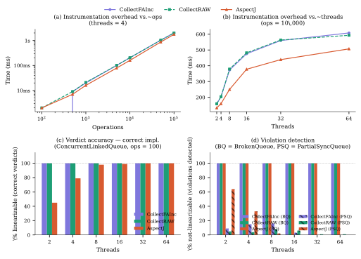

# Experiments

This document explains how to reproduce every result reported in the
paper and provides a complete record of all experimental runs.

---

## Experimental Setup

All experiments use the benchmark methodology of Georges et al. (OOPSLA
2007): 5 warmup rounds (discarded) followed by 10 measured rounds per
cell, reporting mean execution time in milliseconds.

Two machines were used:

| Machine | OS | CPUs | JVM | Flag |
|---|---|---|---|---|
| **Primary** | Linux (Ubuntu) | 64-core | OpenJDK 64-Bit Server VM 21.0.10 | `-Xmx16g` |
| **Supplementary** | macOS | 10-core Apple M | Java HotSpot 64-Bit Server VM 21.0.2 | `-Xmx4g` |

All results reported in the paper come from the **primary (64-core)
machine** unless otherwise noted. Supplementary results from the
macOS laptop are included here for reproducibility reference.

---

## Reproducing the Paper's Results

### Build

```bash
git clone https://github.com/PRISM-Concurrent/efficient-distributed-rv
cd efficient-distributed-rv
mvn clean package -DskipTests
```

### Table C — Instrumentation Overhead

```bash
java -Xmx16g \
     -cp target/efficient-distributed-rv-*-jar-with-dependencies.jar \
     phd.experiments.VerifierBenchmark \
     --only=tableC --format=org --output=results/tableC.org
```

### Table D — Verdict Accuracy (correct implementation)

```bash
java -Xmx16g \
     -cp target/efficient-distributed-rv-*-jar-with-dependencies.jar \
     phd.experiments.VerifierBenchmark \
     --only=tableD --format=org --output=results/tableD.org
```

### Table D — Verdict Accuracy (broken implementations)

```bash
# BrokenQueue
java -Xmx16g \
     -cp target/efficient-distributed-rv-*-jar-with-dependencies.jar \
     phd.experiments.VerifierBenchmark \
     --only=tableD \
     --broken=phd.distributed.verifier.BrokenQueue \
     --format=org --output=results/tableD-broken.org

# PartialSyncQueue
java -Xmx16g \
     -cp target/efficient-distributed-rv-*-jar-with-dependencies.jar \
     phd.experiments.VerifierBenchmark \
     --only=tableD \
     --broken=phd.distributed.verifier.PartialSyncQueue \
     --format=org --output=results/tableD-partialsync.org
```

### Table E — All Implementations

```bash
java -Xmx16g \
     -cp target/efficient-distributed-rv-*-jar-with-dependencies.jar \
     phd.experiments.VerifierBenchmark \
     --only=tableE --format=org --output=results/tableE.org
```

### AspectJ strategy

All commands above run `CollectFAInc` and `CollectRAW` by default.
For the AspectJ strategy, prepend:

```bash
java -javaagent:$HOME/.m2/repository/org/aspectj/aspectjweaver/1.9.21/aspectjweaver-1.9.21.jar \
     --add-opens java.base/java.lang=ALL-UNNAMED \
     -Xmx16g -cp target/...jar phd.experiments.VerifierBenchmark ...
```

---

## Table C — Instrumentation Overhead

`taskProducers()` only — no linearizability checking is performed.
All results: 64-core Linux server, OpenJDK 21.0.10.

### C.1 Fixed threads = 4, operations swept

| Ops | CollectFAInc (mean ms) | CollectRAW (mean ms) | AspectJ (mean ms) |
|---|---|---|---|
| 100 | 0 | 2 | 2 |
| 500 | 9 | 9 | 7 |
| 1 000 | 20 | 21 | 16 |
| 5 000 | 101 | 101 | 79 |
| 10 000 | 204 | 204 | 160 |
| 50 000 | 1 031 | 1 028 | 869 |
| 100 000 | 2 005 | 2 002 | 1 757 |

### C.2 Fixed ops = 10 000, threads swept

| Threads | CollectFAInc (mean ms) | CollectRAW (mean ms) | AspectJ (mean ms) |
|---|---|---|---|
| 2 | 160 | 159 | 133 |
| 4 | 204 | 204 | 160 |
| 8 | 373 | 379 | 250 |
| 16 | 476 | 482 | 378 |
| 32 | 560 | 563 | 439 |
| 64 | 608 | 593 | 507 |

**Interpretation.**
`CollectFAInc` and `CollectRAW` show virtually identical overhead in
all configurations (difference < 1% in all cells). Both scale linearly
with operation count: 10× more operations yield approximately 10×
more time. Scaling with thread count is sub-linear: going from 2 to
64 threads (32×) increases overhead by only ~4× at 10 000 operations,
indicating that the framework distributes work effectively across cores.

AspectJ is consistently 20–30% faster in raw instrumentation time
because `@AfterReturning` records a single event per operation after
completion, whereas the snapshot implementations record two events
(invocation and response) with shared-state access in between. This
performance advantage does not reflect correctness, as shown below.

**Note on sub-millisecond values.** The value of 0 ms for
`CollectFAInc` at 100 operations reflects sub-millisecond execution
(< 1 ms after rounding from nanoseconds). `CollectRAW` shows 2 ms at
the same configuration because `buildXE()` performs additional work
to reconstruct the happens-before relation via topological sort.

<details>
<summary>Full Table C data with min/max (64-core Linux)</summary>

**threads=2**

| Ops | GAI mean/min/max | RAW mean/min/max | AJ mean/min/max |
|---|---|---|---|
| 100 | 4/3/7 | 3/3/4 | 1/1/2 |
| 500 | 6/5/10 | 8/7/10 | 4/4/4 |
| 1 000 | 15/10/22 | 16/15/21 | 12/10/16 |
| 5 000 | 77/64/87 | 80/78/88 | 63/59/74 |
| 10 000 | 160/143/167 | 159/131/175 | 133/125/146 |
| 50 000 | 810/779/847 | 804/788/832 | 695/681/715 |
| 100 000 | 1616/1572/1668 | 1614/1571/1666 | 1392/1357/1430 |

**threads=8**

| Ops | GAI mean/min/max | RAW mean/min/max | AJ mean/min/max |
|---|---|---|---|
| 100 | 0/0/0 | 1/0/2 | 2/2/2 |
| 1 000 | 30/20/36 | 31/22/39 | 20/16/26 |
| 10 000 | 373/288/390 | 379/362/391 | 250/227/297 |
| 100 000 | 3966/3820/4022 | 3845/3736/3927 | 3014/2875/3160 |

**threads=16**

| Ops | GAI mean/min/max | RAW mean/min/max | AJ mean/min/max |
|---|---|---|---|
| 10 000 | 476/437/492 | 482/472/493 | 378/365/412 |
| 100 000 | 4866/4756/5009 | 4890/4811/5049 | 3992/3864/4161 |

**threads=32**

| Ops | GAI mean/min/max | RAW mean/min/max | AJ mean/min/max |
|---|---|---|---|
| 10 000 | 560/516/579 | 563/553/578 | 439/411/472 |
| 100 000 | 5660/5518/5742 | 5674/5606/5777 | 4813/4748/4903 |

**threads=64**

| Ops | GAI mean/min/max | RAW mean/min/max | AJ mean/min/max |
|---|---|---|---|
| 10 000 | 608/586/661 | 593/577/604 | 507/475/554 |
| 100 000 | 6218/6133/6333 | 6178/6095/6277 | 5618/5472/5792 |

</details>

---

## Table D — Verdict Accuracy on a Correct Implementation

Full pipeline (instrumentation + verification). Implementation:
`java.util.concurrent.ConcurrentLinkedQueue` (correct).
Expected verdict: always linearizable (%T = 100, %F = 0, %E = 0).

### D.1 Primary result — 64-core Linux, ops = 100, 100 runs per cell

| Threads | GAI %T | GAI %F | GAI %E | RAW %T | RAW %F | RAW %E | AJ %T | AJ %F | AJ %E |
|---|---|---|---|---|---|---|---|---|---|
| 2 | 100 | 0 | 0 | 100 | 0 | 0 | 45 | 55 | 0 |
| 4 | 100 | 0 | 0 | 100 | 0 | 0 | 79 | 21 | 0 |
| 8 | 100 | 0 | 0 | 100 | 0 | 0 | 98 | 2 | 0 |
| 16 | 100 | 0 | 0 | 100 | 0 | 0 | 99 | 1 | 0 |
| 32 | 100 | 0 | 0 | 100 | 0 | 0 | 100 | 0 | 0 |
| 64 | 100 | 0 | 0 | 100 | 0 | 0 | 100 | 0 | 0 |

**Interpretation.**
`CollectFAInc` and `CollectRAW` produce correct verdicts in 100% of
runs across all thread configurations. AspectJ produced false negatives
in 55% of runs with 2 threads, decreasing monotonically to 0% at 32
and 64 threads. This reveals two regimes:

- **High CPU contention** (threads < available cores): threads compete
  for CPU time, increasing the probability that a context switch occurs
  between an operation's completion and its trace capture in
  `@AfterReturning`. The observed execution differs from the actual
  one, producing a false non-linearizable verdict.
- **Genuine parallelism** (threads ≈ cores): each thread runs on a
  dedicated core without preemption. The non-atomicity window shrinks
  to near zero and AspectJ's false negative rate drops accordingly.

This confirms the structural argument of El-Hokayem & Falcone (RV
2018): the observer effect is a property of the AspectJ instrumentation
mechanism, not of the system under inspection.

### D.2 Supplementary — 10-core macOS, ops = 100, 100 runs per cell

Consistent with D.1, but limited to 2 and 4 threads (contention regime only).

| Threads | GAI %T | GAI %F | GAI %E | RAW %T | RAW %F | RAW %E | AJ %T | AJ %F | AJ %E |
|---|---|---|---|---|---|---|---|---|---|
| 2 | 100 | 0 | 0 | 100 | 0 | 0 | 72 | 28 | 0 |
| 4 | 100 | 0 | 0 | 100 | 0 | 0 | 89 | 11 | 0 |

The lower false negative rate for AspectJ on macOS (28% vs 55% at 2
threads) is consistent with the regime argument: on a 10-core machine,
2 threads have more CPU time available and fewer context switches,
reducing the non-atomicity window relative to the 64-core server.

---

## Table D — Verdict Accuracy on a Severely Broken Implementation

Implementation: `BrokenQueue` (severe race condition in `offer`/`poll`).
Expected verdict: always not-linearizable (%T = 0, %F = 100, %E = 0).
64-core Linux, ops = 100, 100 runs per cell.

| Threads | GAI %T | GAI %F | GAI %E | RAW %T | RAW %F | RAW %E | AJ %T | AJ %F | AJ %E |
|---|---|---|---|---|---|---|---|---|---|
| 2 | 0 | 100 | 0 | 0 | 100 | 0 | 0 | 100 | 0 |
| 4 | 0 | 100 | 0 | 0 | 100 | 0 | 0 | 100 | 0 |
| 8 | 0 | 100 | 0 | 0 | 100 | 0 | 0 | 100 | 0 |
| 16 | 0 | 100 | 0 | 0 | 100 | 0 | 0 | 100 | 0 |
| 32 | 0 | 100 | 0 | 0 | 100 | 0 | 0 | 100 | 0 |
| 64 | 0 | 100 | 0 | 0 | 100 | 0 | 0 | 100 | 0 |

**Interpretation.**
All three strategies correctly detect `BrokenQueue` as non-linearizable
in 100% of runs across all thread configurations. The race condition in
`BrokenQueue` is severe enough to manifest in every execution with 100
operations, so all strategies agree. The key asymmetry with Table D.1
is that AspectJ produces false negatives *only on correct
implementations* — precisely the scenario most harmful to a developer,
who may incorrectly modify code that does not need to change.

---

## Table D — Verdict Accuracy on a Subtly Broken Implementation

Implementation: `PartialSyncQueue` (subtle race condition: `offer()`
is synchronized but `poll()` is not, creating a window between
`isEmpty()` and `removeFirst()`). Expected verdict: not-linearizable,
but the violation only manifests under specific interleavings.
64-core Linux, ops = 60, 100 runs per cell.

**Note on operation count.** With ops = 100, the linearizability
checker may not terminate within a reasonable time on traces where the
violation is ambiguous, because the checker must explore all possible
linearizations. We therefore limit to ops = 60, using a 30-minute
per-run timeout; no run exceeded the timeout.

| Threads | GAI %T | GAI %F | GAI %E | RAW %T | RAW %F | RAW %E | AJ %T | AJ %F | AJ %E |
|---|---|---|---|---|---|---|---|---|---|
| 2 | 91 | 9 | 0 | 95 | 5 | 0 | 36 | 64 | 0 |
| 4 | 85 | 15 | 0 | 96 | 4 | 0 | 67 | 33 | 0 |
| 8 | 84 | 16 | 0 | 92 | 8 | 0 | 98 | 2 | 0 |
| 16 | 97 | 3 | 0 | 94 | 6 | 0 | 100 | 0 | 0 |
| 32 | 100 | 0 | 0 | 99 | 1 | 0 | 100 | 0 | 0 |
| 64 | 100 | 0 | 0 | 99 | 1 | 0 | 100 | 0 | 0 |

**Interpretation.**
The `%F` column for `CollectFAInc` and `CollectRAW` reflects the
fraction of runs in which the race condition actually manifested and
was correctly detected (3–16% at low thread counts). The remaining
runs correspond to executions where the violation did not occur within
60 operations — a genuinely linearizable execution, so the verdict is
correct in both cases. No false positives are produced.

AspectJ shows the opposite problem at low thread counts: with 2
threads, it produces 64% false negatives — runs where the violation
occurred but the non-atomic `@AfterReturning` instrumentation failed
to capture it. At high thread counts this gap closes, but by then the
violation itself becomes harder to trigger.

**Supplementary — 10-core macOS, ops = 50, 100 runs per cell.**

| Threads | GAI %T | GAI %F | RAW %T | RAW %F | AJ %T | AJ %F |
|---|---|---|---|---|---|---|
| 2 | 99 | 1 | 95 | 5 | 85 | 15 |
| 4 | 96 | 4 | 97 | 3 | 86 | 14 |
| 8 | 97 | 3 | 99 | 1 | 100 | 0 |
| 16 | 100 | 0 | 100 | 0 | 100 | 0 |
| 32 | 100 | 0 | 100 | 0 | 98 | 2 |
| 64 | 100 | 0 | 100 | 0 | 99 | 1 |

Consistent with the 64-core results: both machines show the race
condition manifesting at low thread counts, with AspectJ missing more
violations than the snapshot strategies.

---

## Table E — Coverage Across Data Structure Types

Full pipeline, threads = 4, ops = 30, 10 runs per cell.
64-core Linux server. `OK` = verdict matches expected;
`FAIL` = unexpected verdict.

**Note.** The results below correspond to a pilot run (10 runs per
cell) and are included here to document the coverage experiment in
detail. The final figures reported in the paper (Table `tab:tableE`)
use a larger sample size (100 runs per cell) and include an
additional `PartialSyncQueue` row. The trends shown here are
consistent with the paper's results.

**Note on PartialSyncQueue.** With only 30 operations and 10 runs,
the race condition in `PartialSyncQueue` rarely manifests, so results
are statistically unreliable for this implementation. For
`PartialSyncQueue`, refer to the Table D results above (60 ops,
100 runs) for a meaningful assessment.

| Implementation | Expected | GAI %T | GAI Match | RAW %T | RAW Match | AJ %T | AJ Match |
|---|---|---|---|---|---|---|---|
| **Queues** | | | | | | | |
| ConcurrentLinkedQueue | LIN | 100 | OK | 100 | OK | 60 | OK |
| LinkedBlockingQueue | LIN | 100 | OK | 100 | OK | 70 | OK |
| LinkedTransferQueue | LIN | 100 | OK | 100 | OK | 60 | OK |
| **Deques** | | | | | | | |
| ConcurrentLinkedDeque | LIN | 100 | OK | 100 | OK | 60 | OK |
| LinkedBlockingDeque | LIN | 100 | OK | 100 | OK | 90 | OK |
| **Sets** | | | | | | | |
| ConcurrentSkipListSet | LIN | 100 | OK | 100 | OK | 100 | OK |
| **Maps** | | | | | | | |
| ConcurrentHashMap | LIN | 100 | OK | 100 | OK | 0 | **FAIL** |
| ConcurrentSkipListMap | LIN | 100 | OK | 100 | OK | 0 | **FAIL** |
| **Non-linearizable** | | | | | | | |
| BrokenQueue | NOT LIN | 0 | OK | 0 | OK | 0 | OK |
| NonLinearizableQueue | NOT LIN | 10 | OK | 10 | OK | 10 | OK |

**Interpretation.**
`CollectFAInc` and `CollectRAW` produce correct verdicts for all 10
implementations. AspectJ produces false negatives for queue and deque
implementations (10–40% of runs) and fails entirely on map
implementations, reporting 100% false negatives for both
`ConcurrentHashMap` and `ConcurrentSkipListMap`.

The failure on maps is consistent across both test machines and across
multiple runs. It is attributable to incorrect argument capture in
`@AfterReturning` for multi-argument operations: `put(key, value)`
requires both arguments to verify consistency against the sequential
map specification, but AspectJ's `JoinPoint.getArgs()` does not
reliably capture all arguments under concurrent execution, producing
a structurally malformed trace that the verifier always rejects as
non-linearizable. This is independent of the thread scheduler.

**Supplementary — 10-core macOS, same parameters.**
Results were consistent: `CollectFAInc` and `CollectRAW` correct on
all implementations; AspectJ FAIL on `ConcurrentHashMap` and
`ConcurrentSkipListMap`; variable false negative rate on queues and
deques (10–40%).

---
## Visual Summary

The performance scaling and accuracy gaps detailed in the tables above are visually synthesized in the following figure.



___

## Additional Examples

These are not reported in the paper but demonstrate the framework's
broader capabilities.

### Quick sanity check — all 8 correct algorithms

```bash
java -cp target/efficient-distributed-rv-*-jar-with-dependencies.jar \
     phd.experiments.BatchExecution
```

Verifies `ConcurrentLinkedQueue`, `ConcurrentHashMap`,
`ConcurrentLinkedDeque`, `LinkedBlockingQueue`,
`ConcurrentSkipListSet`, `LinkedTransferQueue`,
`ConcurrentSkipListMap`, and `LinkedBlockingDeque`. All are verified
as linearizable and the run completes in under 1 minute.

### Non-linearizable detection

```bash
java -cp target/efficient-distributed-rv-*-jar-with-dependencies.jar \
     NonLinearizableTest
```

`BrokenQueue` and `NonLinearizableQueue` are both correctly identified
as non-linearizable, confirming that the monitoring layer functions
correctly before running paper experiments.

### Workload pattern comparison

```bash
java -cp target/efficient-distributed-rv-*-jar-with-dependencies.jar \
     phd.experiments.ProducersBenchmark --format=org
```

Compares instrumentation overhead across random, producer-consumer,
read-heavy, and write-heavy workload patterns. Read-heavy workloads
produce faster verification because read-only operations introduce
fewer ordering constraints into the history passed to JIT-Lin.