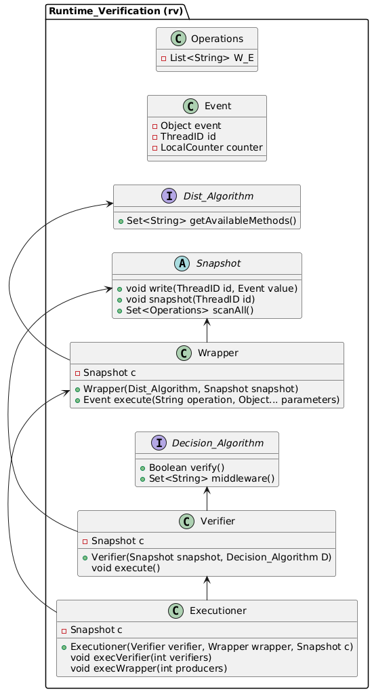

* Diagrams

#+begin_src plantuml :file classes.png :exports results
  left to right direction
  allow_mixing
  package "Runtime_Verification (rv)" {
          interface Dist_Algorithm {
                  ' Instance of algorithm A
                  + List<MethodInf> methods()
                  + Object apply(Object args, Method method)
          }
          interface Decision_Algorithm {
                  ' Algorithm D
                  + Boolean verify()
                  + Set<String> middleware()
          }
          class Event {
                  - Object event
                  - ThreadID id
                  - Counter counter
                  + void Event(event,id,counter)
                  + Object getEvent()
                  + int getId()
                  + int getCounter()
                  + String toString()
          }
          class MethodInf {
                  - Method method;
                  - String name;
                  - List<Type> typeParam;
                  - Type typeReturn;
                  + void MethodInf(Method method)
          }
          class Wrapper {
                  ' Shared object
                  - Snapshot c
                  - Dist_Algorithm A
                  ' Algorithm A+ or A* (with collect or atomic snapshots)
                  + Wrapper(Dist_Algorithm, Snapshot snapshot)
                  ' Returns a response event (write in the snapshot)
                  + void execute(ThreadID id)
          }
          class Verifier {
                  ' Shared object
                  - Snapshot c
                  ' A+ should shared?
                  + Verifier(Snapshot snapshot, Decision_Algorithm D)
                  ' Here, processes read results from the snapshot
                  void execute()
          }
          class Executioner {
                  ' Shared object
                  - Snapshot c
                  - Wrapper wrapper
                  - Verifier verifier
                  - int processes
                  + Executioner(int processes, Dist_Algorithm A)
                  ' Each process use the same instance of Verifier or not?
                  void taskVerifiers(int verifiers)
                  void taskProducers(int producers)
          }
          abstract class Snapshot {
                  ' A process writes an invocation or response event
                  + void write(ThreadID id, Event value)
                  ' A non-atomic snapshot is a collect
                  + void snapshot(ThreadID id, Event Response)
                  ' scanAll reads all events already written in the Snapshot                  
                  + Set<Operations> scanAll()
          }
          class Collect_FetchAndInc {
                  ' Shared object that uses fetch and inc
                  - Atomic_Counter ts
                  ' Shared object of SWMR sequential queues
                  - Set<Sequential_Queue> queues
                  ' A process writes an invocation or response event
                  + void write(ThreadID id, Event value)
                  ' A collect with timestamps
                  + void snapshot(ThreadID id, Event response)
                  ' scanAll reads all events already written in the Snapshot                  
                  + Set<Operations> scanAll()
          }
          class Collect_DAG {
                  ' Shared object, DAG of SWMR Nodes
                  - DAG<Node> 
                  ' A process writes an invocation or response event
                  + void write(ThreadID id, Event value)
                  ' A collect with timestamps
                  + void snapshot(ThreadID id, Event response)
                  ' scanAll reads all events already written in the Snapshot                  
                  + Set<Operations> scanAll()
          }
          class Node {
                  ' Shared object, DAG of SWMR Nodes
                  - Node<Array> pointer_array
                  ' A process writes an invocation or response event
                  + void Node(Event value)
                  + void Node(Event value, Node<Array> pointer_array)
          }
          Wrapper -> Dist_Algorithm
          Wrapper -> Snapshot
          Verifier -> Snapshot
          Verifier -> Decision_Algorithm
          Executioner -> Verifier
          Executioner -> Wrapper
          Collect_FetchAndInc --|> Snapshot
          Collect_DAG --|> Snapshot
          Collect_DAG -> Node
  }

#+end_src

#+RESULTS:

